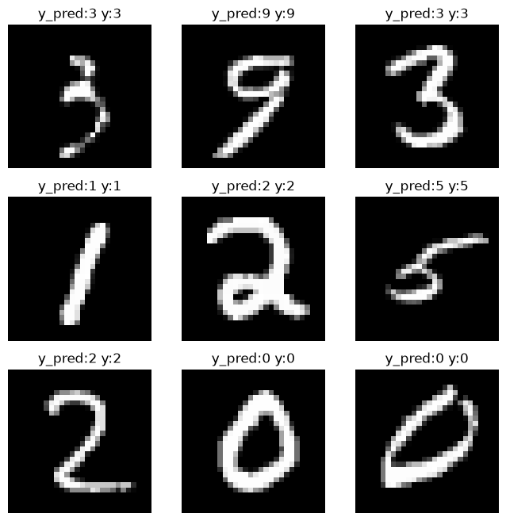
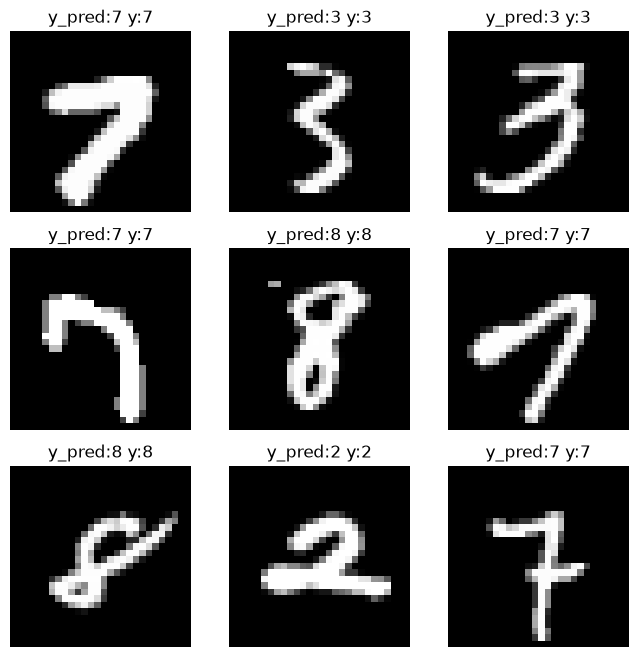

# MNIST с нуля на NumPy


Проект сделан за 3 дня в учебных целях.  
Здесь нет PyTorch, TensorFlow или других фреймворков — только **NumPy** и цепное правило.  
Всё, от линейных слоёв до оптимизатора Adam, написано руками.

Цель — разобраться, как на самом деле работают градиенты и обратное распространение, когда нельзя положиться на `autograd`.

---

## Что внутри

- **Нейросеть**: 3 линейных слоя (784 → 64 → 32 → 10), активации ReLU, выходной Softmax.
- **Backprop**: реализован вручную для каждого слоя с сохранением градиентов.
- **Оптимизатор**: самописный Adam с коррекцией смещения.
- **Точность на тесте**: ~91.05% (9105 из 10000) — неплохо для полносвязной сети без свёрток.

---

## Данные

Используется классический **MNIST** — 60 000 изображений для обучения, 10 000 для теста.  
Каждая картинка — это 28×28 пикселей в градациях серого.  
Мы преобразуем их в вектор длины 784 и нормализуем в диапазон `[0, 1]`.

---

## Архитектура сети

| Слой       | Размерность | Активация |
|------------|-------------|-----------|
| Вход       | 784         | –         |
| Linear 1   | 784 → 64    | ReLU      |
| Linear 2   | 64 → 32     | ReLU      |
| Linear 3   | 32 → 10     | Softmax   |

Веса инициализируются по Ксавье (масштабирование по входной размерности):  
$$W \sim \mathcal{N}\left(0, \sqrt{\frac{2}{n_{in}}}\right)$$

---

## Как работает обратное распространение (backprop)

### Линейный слой

Прямой проход:  
$$y = xW + b$$

Градиент по входу (передаётся на предыдущий слой):  
$$\frac{\partial L}{\partial x} = \frac{\partial L}{\partial y} \cdot W^T$$

Градиенты для обновления параметров:  
$$\frac{\partial L}{\partial W} = x^T \cdot \frac{\partial L}{\partial y}, \quad \frac{\partial L}{\partial b} = \sum_{batch} \frac{\partial L}{\partial y}$$

### ReLU

$$y = \max(0, x)$$  
$$\frac{\partial L}{\partial x} = \frac{\partial L}{\partial y} \odot \mathbb{1}_{y > 0}$$

### Кросс-энтропия + Softmax

Градиент по выходу сети (для батча):  
$$\frac{\partial L}{\partial y} = \hat{y} - y_{true}$$

После этого градиент последовательно передаётся через все слои в обратном порядке — каждый слой сохраняет свои градиенты для последующего обновления.

---

## Оптимизатор Adam

Своя реализация, без внешних библиотек.

На каждом шаге $t$:

$$m_t = \beta_1 m_{t-1} + (1-\beta_1) g_t$$ 

$$v_t = \beta_2 v_{t-1} + (1-\beta_2) g_t^2$$  

$$\hat{m}_t = \frac{m_t}{1-\beta_1^t}, \quad \hat{v}_t = \frac{v_t}{1-\beta_2^t}$$  

$$w_{t+1} = w_t - \eta \frac{\hat{m}_t}{\sqrt{\hat{v}_t} + \varepsilon}$$

Гиперпараметры:  
`lr = 0.001`, `β1 = 0.9`, `β2 = 0.999`, `ε = 1e-8`.

---

## Результаты

После обучения на 60 000 картинках (батч = 32) модель показала на тестовой выборке:
correct: 9105
dont correct: 895
→ Accuracy: 91.05%

**Примеры предсказаний** (слева — правильная метка, справа — предсказание сети):

  


Картинки генерируются автоматически в ноутбуке.

---

## Как запустить

1. Установи зависимости:  
   ```bash
   pip install numpy matplotlib torchvision
